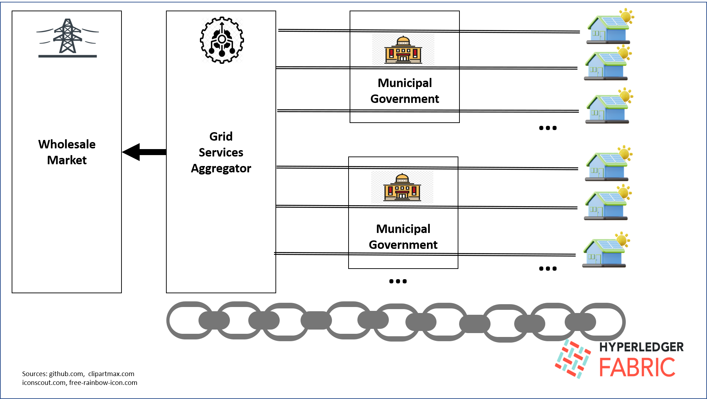

# Energychain UI

## Introduction

Energychain is a blockchain based system for recording energy use, billing, and
for trading energy through a grid services aggregator (GSA). 
Energychain was built on top of
Hyperledger Fabric and is based on the [Electriq muni-resi program](https://www.globenewswire.com/en/news-release/2021/03/22/2196953/0/en/Electriq-Power-to-Provide-Industry-Leading-PowerPod-2-Systems-to-Residents-of-Parlier-California-Under-Innovative-Home-Solar-and-Energy-Efficiency-Program.html). This UI doesn't
actually connect to the blockchain and isn't the UI that was used to demo
at the [IEEE GET Blockchain Forum conference](https://get.blockchain.ieee.org/?mkt_tok=NzU2LUdQSC04OTkAAAGFbksp0NE6-bZ9Q_5NX1UoCtBsy5Q2Ezt20WsRZFl17EfoGv1B_fFn8ospkBOLxn6dpR_T_N3-Nc2f9zuCbVBBzPcYfOyZzmdd68iGL2a-sAY) but is an alternative
with slightly different functionality and all the data hard-coded into the
Javascript UI application.

## System Architecture

EnergyChain is a system for recording energy usage, billing information, and facilitating 
wholesale market trading through a grid services aggregator (GSA) for residential solar 
and battery residential power purchase agreement (PPA) offtakers
signed up for a solar + storage PPA through a program like 
the Electriq Muni-Resi program. EnergyChain has three roles:

- The residential PPA customer, who buys electricity at a fixed rate with small annual 
escalator generated by a solar + storage system installed on their residence. The 
PPA customer's battery is programmed with a
small reserve (generally 2-3 kwh) which belongs to the customer and which, 
if depleted, is filled at the going rate 
specified in the PPA. This reserve is for power outages, but the customer has the option
to trade the reserve on the wholesale market through the GSA.

- The GSA (Electriq in this case) which handles aggregating small trading offers
from the residential PPA customers for the wholesale market, records energy generation and
use, and tracks billing. The GSA additionaly
handles the interface with the wholesale market (for example, CAISO in California) for
selling the customers' offers.

- The municipality in which the residential PPA customers live, which receives a small 
percentage of the residential PPA customers' bill payments into an escrow account. Funds
from this account are used to pay the bill for customers whose bills are past due. If the
account exceeds a certain level, the excess rolls over into the municipal treasury.

Communiction of records between the different roles happens through a Hyperledge Fabric
blockchain. Below is a figure illustrating the architecture. The channel structure is arranged
as follows:

- The GSA is on all municipal and residential channels.

- The municipal government is on all residential channels for residents in its juristiction.

- Each residential user is on a separate channel.

This structure ensures confidentiality of customer information.

While the UI included in this repo only simulates a single municipality with three residential customers, the
architecture could in principle be scaled to many customers and many municipalities. 

## Repo structure

There are four subdirectories of the `energychain-ui` directory:

- `resi`- Contains the UI app for the residential PPA offtaker role.
- `muni`- Contains the UI app for the municipal government role.
- `utils`- Contains functions and data shared between the resi and muni UI apps.
- `css` - Contains css files shared between the resi and muni UI apps. 

The UI app for the GSA role has not been implemented yet. 

The `utils` directory files contain account data for hypothetical users in the 
municipality, including an admin user from the municipal government, 
along with anonymized data on consumption, grid export, 
and grid import provided by Electriq, hardcoded into the Javascript files.

Energychain-UI uses [React](https://reactjs.org/), with the [create-react-app package](https://create-react-app.dev/docs/getting-started/) to create the overall applications. 
The Ant Design [components package](https://ant.design/components/overview/)
for widgets and
[graphical package](https://charts.ant.design/en/examples/gallery) for graphs. 
The Ant Design documentation is pretty good but some of the documentation for the graphical package is in Chinese. If you really need to know it, Google 
Translate does a great job on translating Chinese. 

`resi` and `muni` are React apps created with the `create-react-app` tool.

## Installation

The `create-react-app` tool downloads a whole bunch of supporting
Javascript modules.
Since we have two React apps, this would mean duplicating the entire supporting
library in both directories. To get around this problem, we create a fake 
React app directory, install the additional modules we need, and then symlink 
the  `node_modules` directory into the `muni` and `resi` directories. We
also need to symlink the `utils` and `css` directories into the `src`
subdirectory because `npm` won't follow directory paths outside of the 
project directory. Maybe there is some environment variable or configuration
knob to change this behavior, but I've not been able to find it.

### Creating the fake app

First step is to install `create-react-app` at the top level:

	npm install create-react-app
	
Then create a fake app in the directory where you are planning to put the
`energychain-ui` repo:

	npx create-react-app fake
	
After some while, this command will complete. Change into the `fake` directory
and install the dependencies:

	npm install antd

	npm install @ant-design/charts
	
	npm install react-router-dom@6

### Cloning `energychain-ui`

Clone the `energychain-ui`  repo into the same directory where the `fake` app
directory was created:

	git clone https://github.com/jkempf42/energychain-ui.git
	

## Setting up the symbolic links

Change into the `energychain-ui/resi` directory and link the `node_modules`
library directory locally:

	ln -s ../../fake/node_modules ./node_modules
	
Change into the `src` subdirectory and link the `utils` and `css` directories
locally:

	ln -s ../../css ./css
	ln -s ../../utils ./utils

Now change into the `energychain-ui/muni` directory and perform the same
three steps as above for the `muni` application.

You should now be able to run the two apps.

## Running

Change into the `resi` directory and type:

	npm start

`npm` should start the resi app on `localhost:3000`. 

In a separate shell window, change to the `muni` directory and type:

	'npm start`
	
again. `npm` will start up the muni app on a different port. 

The two apps are not linked and all the data is hardcoded, but you can play 
with them to get a sense of how the Energychain system works. Integration with
Hyperledger Fabric is TBD.

## Logins

The login page comes up initially. Login user names for the resi app are "luis", "chauncy",
and "angel". Each resi user has a different solar + storage configuation. 
Login for the muni app is "stephen". The password is not checked but must
be something. 

Other than that, the apps are self explanatory.

## Create React App `README.md`

You should be able to find a copy of the Create React App `README.md`
in the `fake` app directory, if you would like to try extending the apps
or building production versions.
